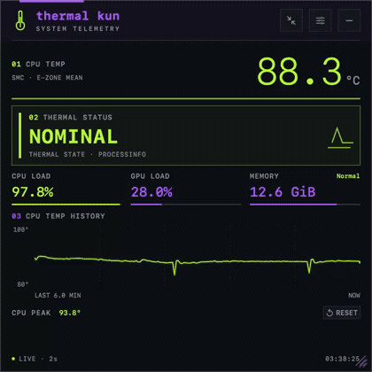
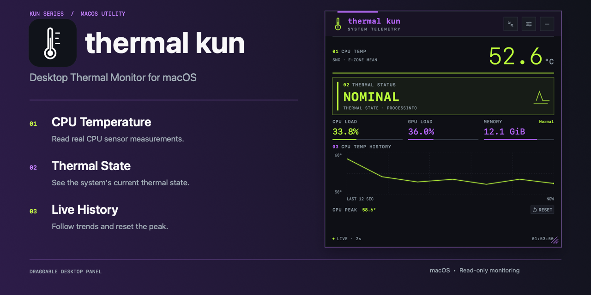
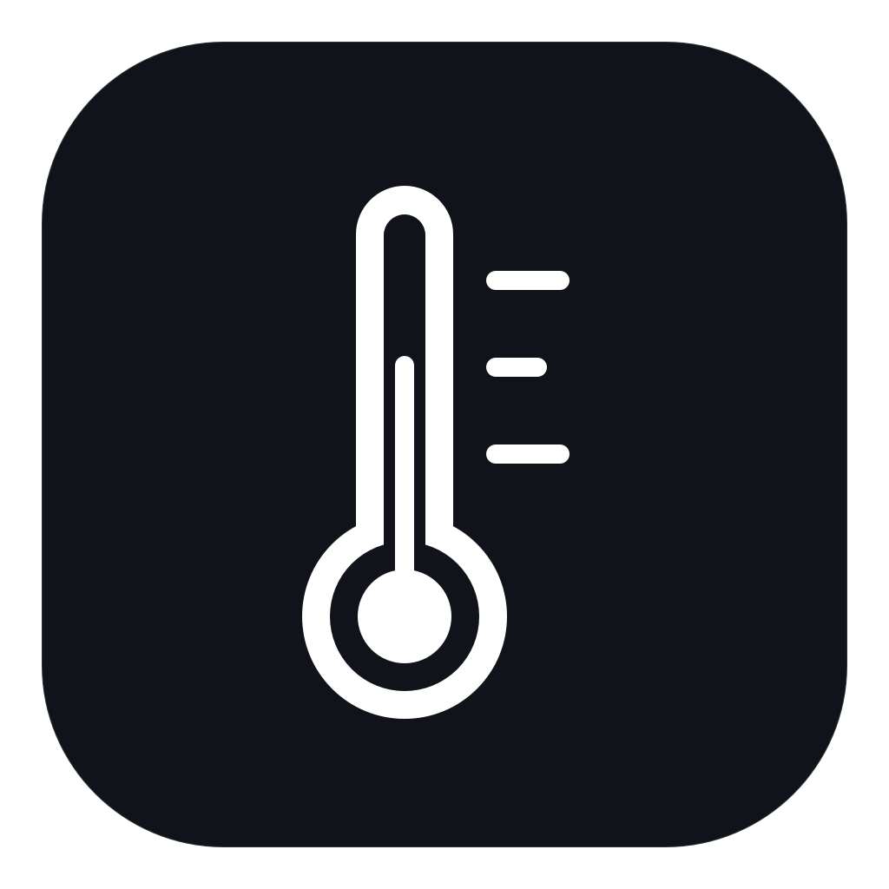
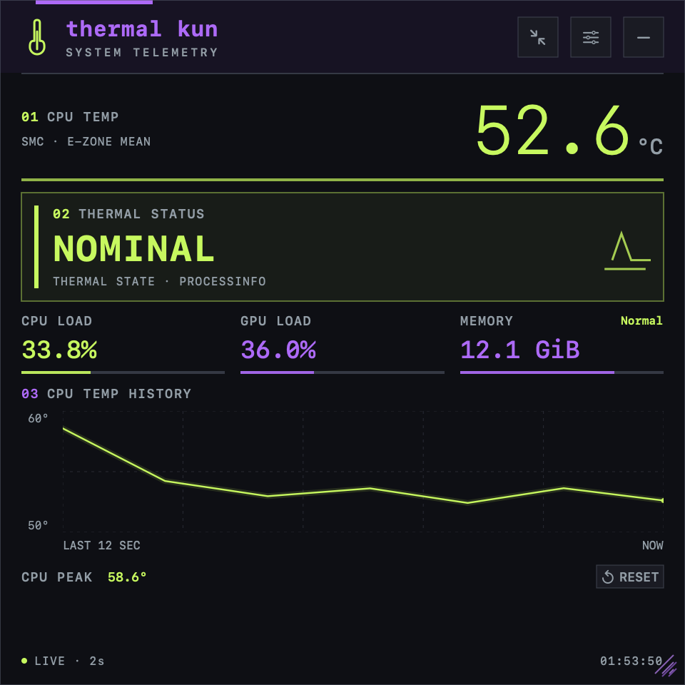
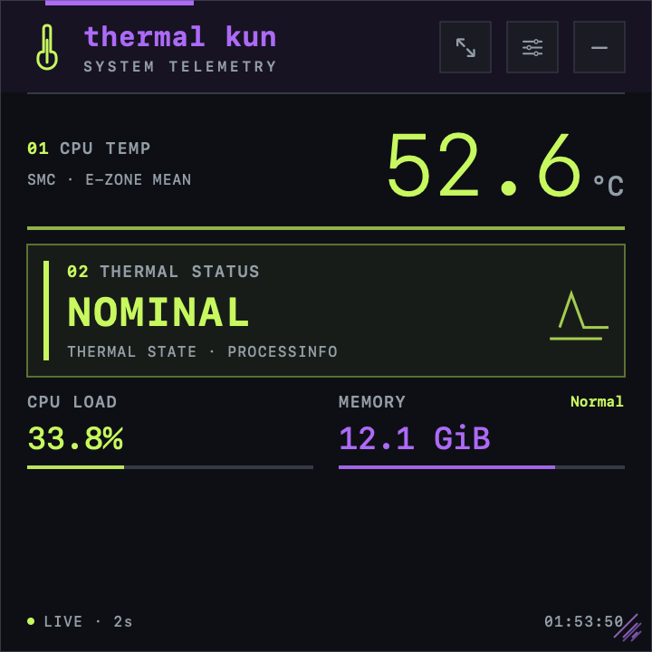
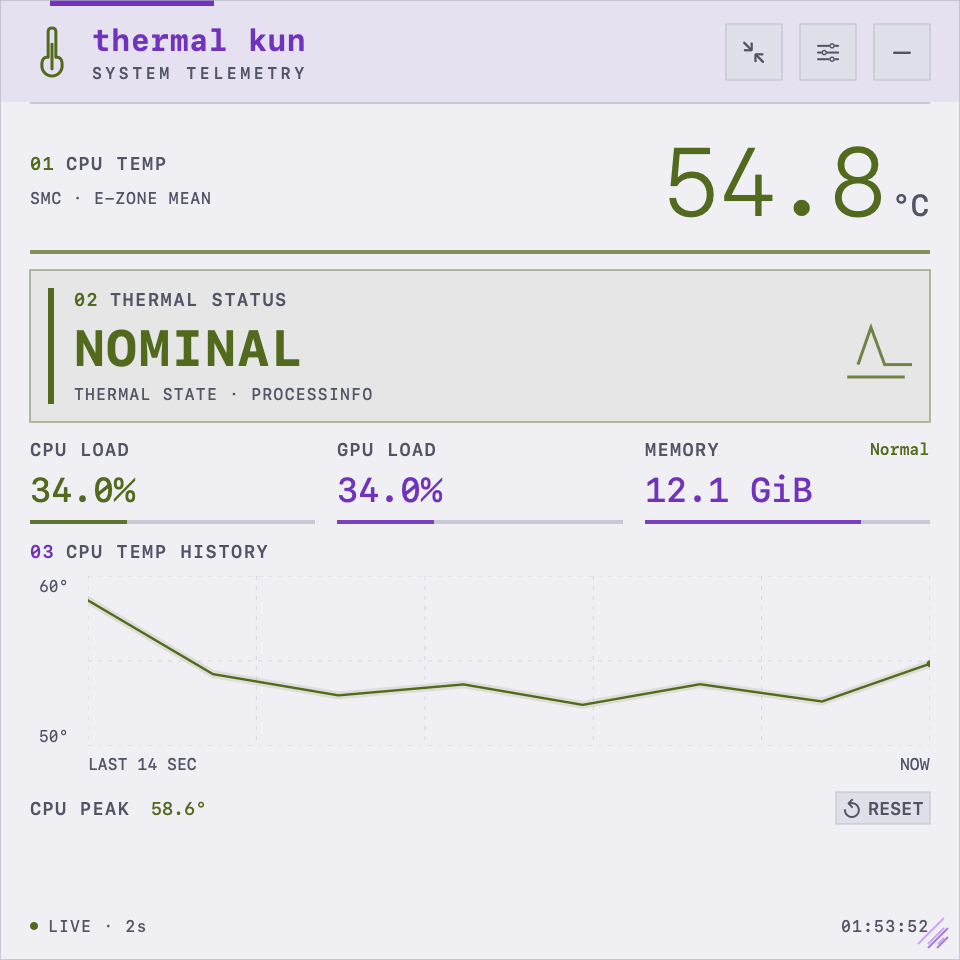
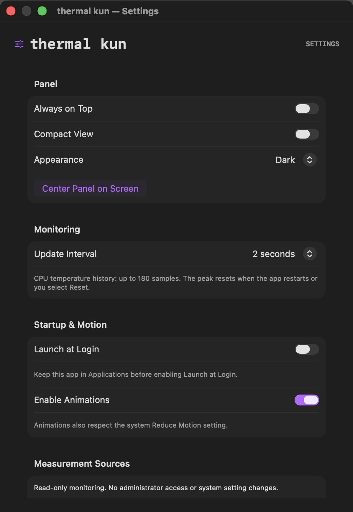

# thermal kun

<p align="right">
  <strong>English</strong> |
  <a href="README.ja.md">日本語</a>
</p>

**Monitor Your Mac's CPU Temperature in Real Time.**

Keep CPU temperature, CPU/GPU usage, memory, and recent temperature history visible in a compact native desktop panel.

**[Download for macOS (Apple Silicon)](https://github.com/Kohei-SAWADA/thermal_kun/releases/download/v1.0.4/thermal-kun-macOS-arm64-v1.0.4.zip)** · [Installation guide](docs/INSTALL.md) · [Demo](#demo)

macOS 13+; the release app is Apple Silicon only and does not support Intel Macs. Ad-hoc signed and not notarized.

## Demo

[Watch the real Mac demo (MP4)](assets/promo/thermal-kun-demo.mp4)



Recorded from the real 1.0.4 app on an M3 Mac. `SMC · E-ZONE MEAN` is the mean of three readable efficiency-zone sensors, not the hottest CPU point. Thermal State is the OS condition, not a throttling percentage. Values reflect the recording workload.

## At a glance

- Live CPU temperature, CPU/GPU load, memory use and pressure.
- Compact/detail views, recent history, and Dark/Light/System appearance.
- A movable, resizable desktop panel with local, read-only measurements.

[Full features](#features) · [Requirements](#requirements) · [Measurement details](#data-sources-and-meaning)

<p align="center">
  
</p>

<p align="center">
  
</p>


A small native macOS app for checking CPU temperature and system thermal conditions at a glance. Built with Swift, SwiftUI, and AppKit, its square desktop panel displays CPU temperature, CPU/GPU usage, and memory. All app labels are in English.

The thermometer logo and **charcoal, purple, and lime green** palette give it a compact cockpit instrument feel. An opaque background, thin rules, square corners, and monospaced numbers keep readings clear. Drag the panel wherever you like, including below Usage Kun.

## Download

The current version is **1.0.4 (build 5)**. Download the Apple Silicon (`arm64`) app from [GitHub Releases](https://github.com/Kohei-SAWADA/thermal_kun/releases/tag/v1.0.4):

- [Download thermal kun for macOS](https://github.com/Kohei-SAWADA/thermal_kun/releases/download/v1.0.4/thermal-kun-macOS-arm64-v1.0.4.zip)
- [SHA-256 checksum](https://github.com/Kohei-SAWADA/thermal_kun/releases/download/v1.0.4/thermal-kun-macOS-arm64-v1.0.4.zip.sha256)

See the [installation guide](docs/INSTALL.md), or the [build and release guide (Japanese)](docs/RELEASING.md) to build from source and prepare a ZIP.

## Screenshots

<p align="center">
  
  <br><em>Detailed view — temperature history and system readings.</em>
</p>

<p align="center">
  
  <br><em>Compact view — the readings you want to glance at while working.</em>
</p>

<p align="center">
  
  <br><em>Light view — readable on a bright desktop.</em>
</p>

<p align="center">
  
  <br><em>Settings — choose the display and update interval, and inspect measurement sources.</em>
</p>

Values reflect the time of capture. Available measurements and sensors depend on the Mac model and macOS version.

## Features

- CPU temperature, `Thermal State`, CPU/GPU usage, memory usage, and memory pressure
- Temperature history capped at 180 samples, plus a resettable session peak
- Drag to move and resize while keeping a 1:1 square; saved position and size with screen-layout recovery
- Compact/detailed views and `Dark`, `Light`, or `System` appearance
- Desktop-level display by default, with an optional `Always on Top` setting
- Menu bar `Show`/`Hide`, `Settings…`, and `Quit thermal kun`, plus optional `Launch at Login`
- Update intervals of 1, 2, 5, or 10 seconds (default: 2); optional short animations that respect Reduce Motion

## Requirements

- Deployment target: macOS 13 or later. Tested on an Apple Silicon Mac; other models and OS versions are unverified.
- Source builds require Swift 6 or later and Xcode Command Line Tools with the macOS SDK.
- Builds target the current Mac architecture. The release ZIP is for Apple Silicon (`arm64`); it is not a Universal Binary.
- macOS only. Monitoring needs no administrator access or privileged helper.

## Quick start

### Install from the release ZIP

1. Download the ZIP from [GitHub Releases](https://github.com/Kohei-SAWADA/thermal_kun/releases/latest) and extract it in Finder.
2. Move the included `thermal kun.app` to `/Applications`.
3. Open the app. If the panel is hidden, choose `Show` from its thermometer menu bar icon.
4. Enable `Launch at Login` in `Settings` only if you want automatic startup.

The app is ad-hoc signed and has not been notarized by Apple. For a macOS developer-verification alert, see [first-launch instructions](docs/INSTALL.md#if-macos-blocks-the-first-launch).

### Build from source

Run these commands in the source directory. No external package installation is needed.

```sh
./Scripts/build.sh
./Scripts/run.sh
```

This creates `build/thermal kun.app`, which can also be opened in Finder.

For ongoing use, copy the app to `/Applications`, quit the development copy, and open the installed copy. `Launch at Login` is off by default. Enable it after launching from a stable location; use `Open Login Items Settings` if macOS requires approval.

### Panel controls

1. Drag the app-name area at the top to move the panel. Drag the bottom-right corner to resize it as a square.
2. Use the arrow button to switch between compact and detailed views. Scroll the detailed panel when needed.
3. Hover over the graph to inspect samples. `RESET` clears only the peak temperature.
4. Open settings with the slider icon or the menu bar `Settings…` item. Choose `Center Panel on Screen` to recover the panel's position.

Place thermal kun and Usage Kun independently. Background opacity is fixed and has no adjustable setting.

### Updates and checks

Choose `Quit thermal kun`, replace the installed `.app` with the new one, and reopen it. Settings and panel placement are stored separately and survive replacing the app. For source updates, update the source and run `./Scripts/build.sh`. See [update instructions](docs/INSTALL.md#updates).

Run the lightweight model, history, and window-placement checks:

```sh
./Scripts/check.sh
```

To inspect real measurements and their sources as JSON after building, run:

```sh
"build/thermal kun.app/Contents/MacOS/ThermalKun" --diagnose
```

This prints the second sample after an interval of approximately two seconds.

## Data sources and meaning

| Display | Source and meaning |
| --- | --- |
| `CPU TEMP` | Arithmetic mean of readable CPU temperature sensors mapped for the Mac. Hover over the reading or open `Settings` → `Measurement Sources` → `Current Sources` for keys, individual values, and aggregation details. |
| `THERMAL STATUS` | The public `ProcessInfo.thermalState` API: `Nominal`, `Fair`, `Serious`, or `Critical`. This is the system's thermal condition, not a performance-loss percentage. |
| `CPU LOAD` / `GPU LOAD` | CPU usage is calculated from differences in Mach CPU tick counters. GPU usage is the driver's device-utilization counter; with multiple GPUs, the maximum readable value is shown. |
| `MEMORY` / `MEMORY PRESSURE` | Estimated used memory from Mach VM counters (GiB), and the kernel's discrete pressure state. The estimate may differ from Activity Monitor. Pressure is not inferred from the usage percentage. |

CPU temperature does not represent a guaranteed hottest point across the entire CPU. On the tested M3 system, three readable efficiency-zone sensors are averaged and labeled `SMC · E-ZONE MEAN`. Sensor zones do not necessarily correspond one-to-one with cores. Apps using package temperatures or maximum sensor values may show different readings.

Unsupported measurements show `Unsupported`; temporary failures show `Unavailable`. Missing readings never become zero or a normal state. Gaps remain in the graph, and delayed or paused updates show `STALE · UPDATES PAUSED`. Monitoring resumes after sleep. The peak covers valid readings since launch or the last reset, and resets when the app restarts.

Temperature and thermal state are separate indicators. `Thermal State` reports the OS thermal condition rather than measuring workload performance. A high temperature alone does not establish thermal throttling.

## Privacy and limitations

Measurements stay local. There is no telemetry, cloud sync, or analytics SDK. This is a read-only monitor; it does not change power or thermal-management settings. Sampling runs on a serial background queue at utility priority, and history is limited to 180 samples.

Temperature access uses the undocumented AppleSMC driver interface in read-only mode. GPU driver statistics and the memory-pressure sysctl are also model/OS dependent and may stop working with future macOS releases. Unknown sensors are not guessed or substituted; available measurements continue working. Launch at Login has not been tested through an actual logout/login cycle.

## Development and license

See the [installation guide](docs/INSTALL.md), [Japanese installation guide](docs/INSTALL.ja.md), [build and release guide (Japanese)](docs/RELEASING.md), and [changelog (Japanese)](CHANGELOG.md).

MIT licensed; see [LICENSE](LICENSE). AppleSMC structure and sensor-key research references [Stats](https://github.com/exelban/stats); the required notices are preserved in [THIRD_PARTY_NOTICES.md](THIRD_PARTY_NOTICES.md). Apple documentation: [ProcessInfo.thermalState](https://developer.apple.com/documentation/foundation/processinfo/thermalstate-swift.property) and [SMAppService](https://developer.apple.com/documentation/servicemanagement/smappservice).
